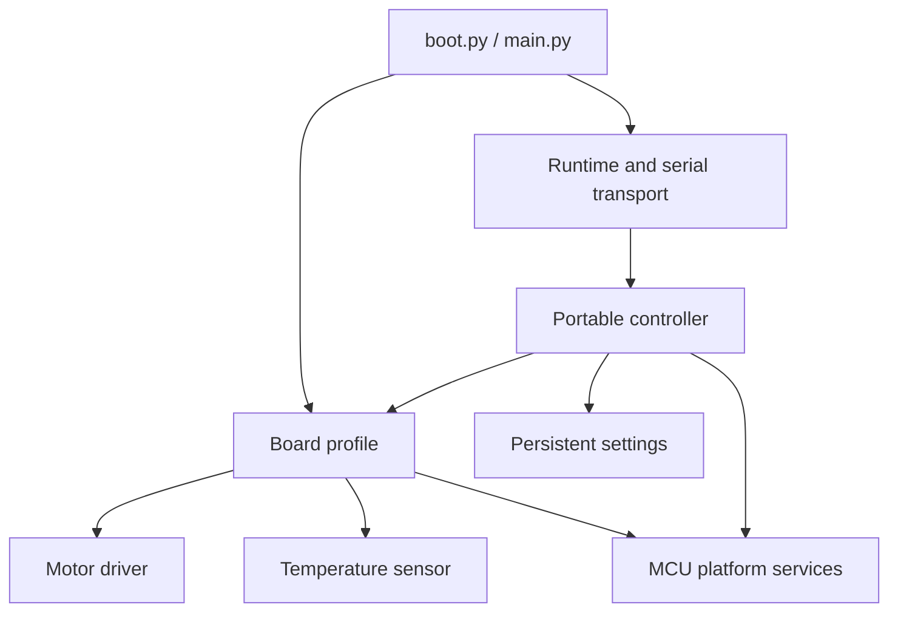

# Firmware architecture and porting

The composition boundary is `firmware/board_config.py`: it exports a `Board`, `Platform`, and `safe_outputs(platform)` from the selected profile. `boot.py` uses it to disable motor outputs before USB setup; `main.py` builds the board and starts the runtime. Importing a profile should define objects, not enable hardware.

Interfaces use ordinary Python objects and small methods rather than a framework or required inheritance. This keeps them usable in MicroPython. Only `platforms/micropython.py` imports `machine`; concrete GPIO values exist only in the board profile. Drivers and sensors receive their I/O objects explicitly. USB support is separate from the controller and optional.

## Add a driver chip

Create `firmware/drivers/<chip>.py` with this contract:

| Member | Required behavior |
| --- | --- |
| `name` | Human-readable chip/adapter name |
| `resolutions` | Nonempty ordered mapping from command name to increments per full motor step, e.g. `{'full': 1, 'half': 2}` |
| `step_note` | Accurate board-relevant explanation shown by the dashboard |
| `enabled` | Boolean logical enable state |
| `enable(resolution)` | Configure resolution, enable safely, and honor required wake/setup time |
| `disable()` | Idempotently de-energize/release the motor; safe before enable and after partial initialization |
| `fault_asserted()` | Return a boolean; normalize chip-specific fault polarity here |
| `step(direction)` | One selected increment in direction `1` or `-1`; do not maintain application move counts |

A STEP/DIR chip can implement `step()` as a pulse with appropriate direction setup/hold timing. A UART/SPI-configured chip owns that register protocol and current configuration in its adapter. Do not emulate microstepping by advertising resolutions unsupported by the physical driver and wiring. A fixed-mode board should advertise only its actual mode.

The controller never sees coil phases or chip registers. Its scheduler uses microsecond deadlines, a distance-based acceleration/deceleration profile, and executes at most one step per iteration; it is intended for low-speed bench control, with no acceleration or timing compensation. Higher rates, DMA/PIO, or queued trajectory control require an explicit scheduler/driver contract extension and tests, not just a higher `max_speed_sps` value.

`tests/fakes.py` supplies a simulated non-DRV8847 driver with full/quarter stepping to demonstrate the contract. It is not a hardware implementation.

## Add a board

Create `firmware/boards/<board>.py`, exporting `Board`, `Platform`, and `safe_outputs(platform)`. Keep pin mapping, electrical polarities, bus selection, motor geometry, limits, and chip construction there. Select with `python3 scripts/build_firmware.py --board <board> --output <empty-directory>`.

`safe_outputs` must put the actual board's enable and motor outputs into a de-energized state. The example's GPIO22-low behavior is specific to its board. A different active-low enable or power gate needs a different safe implementation. The board constructor must keep motion disabled while configuring and validating sensors.

Board members consumed by the controller:

- Identity: `id`, `name`, `mcu`.
- Components: `motor`, `led.value(0|1)`, and `buzzer.set(bool)` / `buzzer.close()`.
- Measurements: `temperature()` returns finite Celsius or raises; `thermal_alert()` returns an asserted-state boolean; `current_a()` returns measured amps or `None` (never substitute a configured current limit for a measurement).
- Geometry and motion limits: `full_steps_per_revolution`, `min_speed_sps`, `max_speed_sps`, `max_steps`.
- Thermal policy: `start_below_c`, `shutdown_c`, `threshold_min_c`, `threshold_max_c`, `threshold_default_c`.
- Timing/UI: `watchdog_ms`, `heartbeat_timeout_ms`, `heartbeat_start_ms`, `buzzer_hz`, `current_note`.

Choose thermal limits based on the actual board, motor, and sensor placement; configure the sensor's hardware limits to match. For the included TMP102, configuration and thresholds are read back and verified on every temperature read. Missing or invalid temperature always prevents motion; an alternate board without temperature sensing needs an explicit policy design, not a fabricated normal reading. Optional absent LEDs or buzzers may use no-op output adapters, with honest documentation.

The current browser sends heartbeats every 400 ms. Profiles must allow enough timeout/start-age margin for that cadence (the supplied profile uses 1500/1000 ms). Adapters must remain bounded so they cannot starve protection checks or the watchdog.

## Add an MCU or runtime

For another MicroPython port, first check its actual `Pin`, `I2C`, `PWM`, watchdog, USB and console implementations. Reuse `platforms/micropython.py` only where those APIs and electrical assumptions match; subclass or replace it where they differ. No second physical MCU is claimed supported yet.

A platform supplies:

| Member | Contract |
| --- | --- |
| `clock` | `ticks_ms()`, `ticks_us()`, wrapping `ticks_diff(a,b)`, `ticks_add(t,delta)`, `sleep_ms(ms)`, `sleep_us(us)` |
| `watchdog(timeout_ms)` | Return an object with `feed()`; raise if the requested protection cannot be provided |
| `transport()` | `read_lines()` returns a bounded batch without blocking; `write_line(str)` sends JSON plus newline |
| `device_id()` | Stable per-device identifier string |
| `reset()` | Hardware reset; must not return in production |
| `configure_usb(name)` | Apply the optional USB label during boot or report unavailable |
| `usb` | `usb_name`, `usb_name_error`; a `None` name means unsupported/unapplied |

Board construction may use additional platform factories such as `output`, `input`, `i2c`, and `tone`; these are not used directly by the controller. A non-MicroPython platform can provide different factories in its own board composition. The CPython tests instantiate the controller without a `machine` module.

The default settings adapter needs Python-compatible `json`, `os.rename`, and a writable filesystem. Runtimes using NVS or another store can inject a different object implementing `load_name()`, `save_name(value)`, `load_threshold(default,min,max)`, and `save_threshold(value)`; retain validation and power-loss behavior. Name persistence and USB descriptor customization are separate concerns.

## Safety and validation boundary

Preserve motor-disabled boot, explicit starts, bounded command input, heartbeat lease, thermal/driver shutdown, watchdog protection, no automatic resume, and output cleanup on exceptions. A driver's enable failure is followed by `disable()`; runtime exceptions also release outputs before propagating. A malformed command must not energize hardware.

Before calling a new target supported, test pin safe states, timing, fault polarity, sensor failures, current limits, watchdog reset, reconnect behavior, persisted settings, and USB enumeration on that hardware. Host tests establish software behavior, not electrical correctness or timing guarantees.

Motion profile settings in a board may override `start_speed_sps`, `default_acceleration_sps2`, `min_acceleration_sps2`, `max_acceleration_sps2` and `settle_ms`. Defaults are 10, 100, 10, 1000 and 100 respectively. Clock microsecond tick operations must use the same wrap semantics as millisecond ticks.
